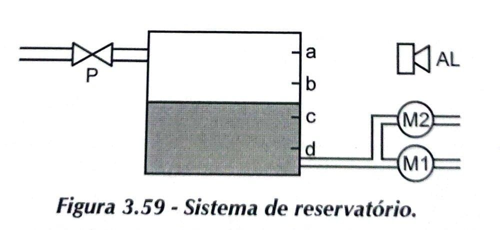

Desenhar o diagrama de interconexões elétricas físicas e o programa de controle do PLC para um sistema de reservatório composto de uma válvula de entrada P, duas bombas (acionadas por M1 e M2), um alarme AL e quatro sensores de nível (a, b, c, d), conforme a Figura 3.59.

As condições de funcionamento são as seguintes: se o nivel for 'a', então fecha-se a válvula P. Se o nivel for inferior a 'b', então abre-se a válvula P. Acima de 'b', M1 e M2 bombeiam.Abaixo de 'b', somente M1 bombeia. Abaixo de 'c', soa o alarme AL. Em 'd', nenhuma das bombas deverá funcionar.